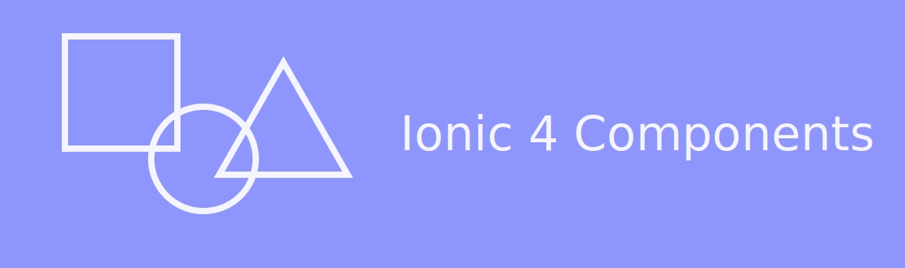
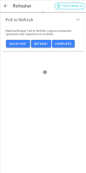
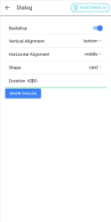
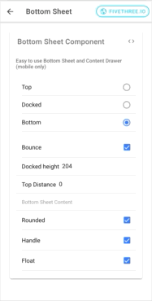

# Ionic 4 Components

Costumizable UI Components for Ionic 4.

[](https://www.npmjs.com/@fivethree/core)

[Documentation](https://fivethree-team.github.io/ionic-4-components) |
[Component Demos](https://fivethree-team.github.io/ionic-4-components/components) |
[Getting Started](https://fivethree-team.github.io/ionic-4-components/getting-started) |
[Get In Touch](https://fivethree.io/)

---



# ✨ Features

- Twitter inspired Image Gallery
- Material Design Pull-to-Refresh
- Flexible Dialog Component
- Feature Discovery
- Material Design App Bar for Ionic Tabs
- [more components](https://fivethree-team.github.io/ionic-4-components/components)

# 📦 Installation

To get started, install the package from npm. The latest version supports Ionic 4 and Angular >= 7.

## Install the UI Library

You can use either npm or yarn to install `@fivethree/core` from npm.

```bash
npm install --save @fivethree/core @angular/animations
```

## Configure your Ionic App

Once the packages are installed, import `BrowserAnimationsModule` in `app.module.ts`:

```typescript
import { NgModule } from '@angular/core';
import { BrowserAnimationsModule } from '@angular/platform-browser/animations';

@NgModule({
  imports: [
    ...
    BrowserAnimationsModule,
    ...
  ]
})
export class AppModule {}
```

## Usage Instructions

To use the **UI Library** import one of the feature modules (e.g. FivGalleryModule) into a Page or Component Module.

For example:

```typescript
import { NgModule } from '@angular/core';
import { CommonModule } from '@angular/common';
import { IonicModule } from '@ionic/angular';
import { FormsModule } from '@angular/forms';
import { RouterModule } from '@angular/router';
import { FivGalleryModule } from '@fivethree/core';

import { HomePage } from './home.page';

@NgModule({
  imports: [
    CommonModule,
    FormsModule,
    IonicModule,
    RouterModule.forChild([
      {
        path: '',
        component: HomePage
      }
    ]),
    FivGalleryModule
  ],
  declarations: [HomePage]
})
export class HomePageModule {}
```

## 🔨 Development

This package is under active construction.

- Run `ng build core` to rebuild the component library.
- Run `ionic s` to serve the project site.
